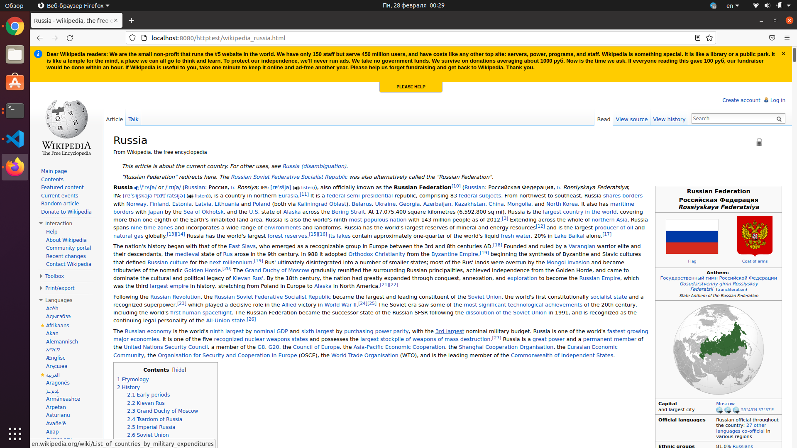

# Проектирование высоконагруженных систем

## Веб сервер
- язык: python
- архитектура: prefork + coroutines

## Описание
Демон *web-server* предназначен для отправки статических файлов.

### Схема работы
Сканирует локальную директорию на предмет наличия запрашиваемого файла. Если файл есть - возвращает в ответе его содержимое со статусом 200. Если файла нет - возвращает ошибку 404.

### api
* /<path_to_file>/<filename>

Примеры использования API:
* http://localhost:8081/httptest/wikipedia_russia.html - возвращается страничка wikipedia_russia.html.

### Конфиг
Включает стандартные секции:
```
cpu_limit 8                         # maximum CPU count to use
thread_limit 256                    # maximum simultaneous connections
document_root /app/http-test-suite  # full path to the proxied folder
```

### Запуск сервера
Для запуска сервера нужно проделать следующие команды
```
make run
chmod +x run_tests.sh
./run_tests.sh host port
```
Команда запустит сервер и сразу же проведет функциональное тестирование

Параметры команды `run_tests.sh`:
- host - хост, на котором сервер запущен
- port - порт, на котором сервер запущен


## Функциональное тестирование
```
make run

chmod +x run_tests.sh
./run_tests.sh localhost 8080

---
Клонирование в «http-test-suite»…
remote: Enumerating objects: 291, done.
remote: Counting objects: 100% (18/18), done.
remote: Compressing objects: 100% (13/13), done.
remote: Total 291 (delta 8), reused 11 (delta 5), pack-reused 273
Получение объектов: 100% (291/291), 2.29 МиБ | 3.73 МиБ/с, готово.
Определение изменений: 100% (37/37), готово.
test_directory_index (__main__.HttpServer)
directory index file exists ... ok
test_document_root_escaping (__main__.HttpServer)
document root escaping forbidden ... ok
test_empty_request (__main__.HttpServer)
Send empty line ... ok
test_file_in_nested_folders (__main__.HttpServer)
file located in nested folders ... ok
test_file_not_found (__main__.HttpServer)
absent file returns 404 ... ok
test_file_type_css (__main__.HttpServer)
Content-Type for .css ... ok
test_file_type_gif (__main__.HttpServer)
Content-Type for .gif ... ok
test_file_type_html (__main__.HttpServer)
Content-Type for .html ... ok
test_file_type_jpeg (__main__.HttpServer)
Content-Type for .jpeg ... ok
test_file_type_jpg (__main__.HttpServer)
Content-Type for .jpg ... ok
test_file_type_js (__main__.HttpServer)
Content-Type for .js ... ok
test_file_type_png (__main__.HttpServer)
Content-Type for .png ... ok
test_file_type_swf (__main__.HttpServer)
Content-Type for .swf ... ok
test_file_urlencoded (__main__.HttpServer)
urlencoded filename ... ok
test_file_with_dot_in_name (__main__.HttpServer)
file with two dots in name ... ok
test_file_with_query_string (__main__.HttpServer)
query string with get params ... ok
test_file_with_slash_after_filename (__main__.HttpServer)
slash after filename ... ok
test_file_with_spaces (__main__.HttpServer)
filename with spaces ... ok
test_head_method (__main__.HttpServer)
head method support ... ok
test_index_not_found (__main__.HttpServer)
directory index file absent ... ok
test_large_file (__main__.HttpServer)
large file downloaded correctly ... ok
test_post_method (__main__.HttpServer)
post method forbidden ... ok
test_request_without_two_newlines (__main__.HttpServer)
Send GET without to newlines ... ok
test_server_header (__main__.HttpServer)
Server header exists ... ok

----------------------------------------------------------------------
Ran 24 tests in 0.020s

OK
```

## Нагрузочное тестирование
### Python: prefork+coroutines
```
$ ab -c 100 -n 1000 http://localhost:8080/httptest/wikipedia_russia.html
This is ApacheBench, Version 2.3 <$Revision: 1843412 $>
Copyright 1996 Adam Twiss, Zeus Technology Ltd, http://www.zeustech.net/
Licensed to The Apache Software Foundation, http://www.apache.org/

Benchmarking localhost (be patient)
Completed 100 requests
Completed 200 requests
Completed 300 requests
Completed 400 requests
Completed 500 requests
Completed 600 requests
Completed 700 requests
Completed 800 requests
Completed 900 requests
Completed 1000 requests
Finished 1000 requests


Server Software:        [python]:prefork&coroutines
Server Hostname:        localhost
Server Port:            8080

Document Path:          /httptest/wikipedia_russia.html
Document Length:        954824 bytes

Concurrency Level:      100
Time taken for tests:   0.737 seconds
Complete requests:      1000
Failed requests:        0
Total transferred:      954975000 bytes
HTML transferred:       954824000 bytes
Requests per second:    1357.22 [#/sec] (mean)
Time per request:       73.680 [ms] (mean)
Time per request:       0.737 [ms] (mean, across all concurrent requests)
Transfer rate:          1265730.51 [Kbytes/sec] received

Connection Times (ms)
              min  mean[+/-sd] median   max
Connect:        0    2   1.3      2       8
Processing:    36   71   7.6     73      93
Waiting:        1    3   3.8      2      26
Total:         37   73   7.7     74      95

Percentage of the requests served within a certain time (ms)
  50%     74
  66%     75
  75%     75
  80%     75
  90%     75
  95%     80
  98%     92
  99%     93
 100%     95 (longest request)
```

### Nginx
```
$ ab -c 100 -n 1000 http://localhost:8081/httptest/wikipedia_russia.html
This is ApacheBench, Version 2.3 <$Revision: 1843412 $>
Copyright 1996 Adam Twiss, Zeus Technology Ltd, http://www.zeustech.net/
Licensed to The Apache Software Foundation, http://www.apache.org/

Benchmarking localhost (be patient)
Completed 100 requests
Completed 200 requests
Completed 300 requests
Completed 400 requests
Completed 500 requests
Completed 600 requests
Completed 700 requests
Completed 800 requests
Completed 900 requests
Completed 1000 requests
Finished 1000 requests


Server Software:        nginx/1.18.0
Server Hostname:        localhost
Server Port:            8081

Document Path:          /httptest/wikipedia_russia.html
Document Length:        954824 bytes

Concurrency Level:      100
Time taken for tests:   0.380 seconds
Complete requests:      1000
Failed requests:        0
Total transferred:      955071000 bytes
HTML transferred:       954824000 bytes
Requests per second:    2633.21 [#/sec] (mean)
Time per request:       37.976 [ms] (mean)
Time per request:       0.380 [ms] (mean, across all concurrent requests)
Transfer rate:          2455963.50 [Kbytes/sec] received

Connection Times (ms)
              min  mean[+/-sd] median   max
Connect:        0    1   0.8      1       5
Processing:    24   36   3.8     37      53
Waiting:        0    1   2.4      1      14
Total:         24   37   4.0     37      54

Percentage of the requests served within a certain time (ms)
  50%     37
  66%     38
  75%     38
  80%     38
  90%     39
  95%     46
  98%     52
  99%     53
 100%     54 (longest request)
```

